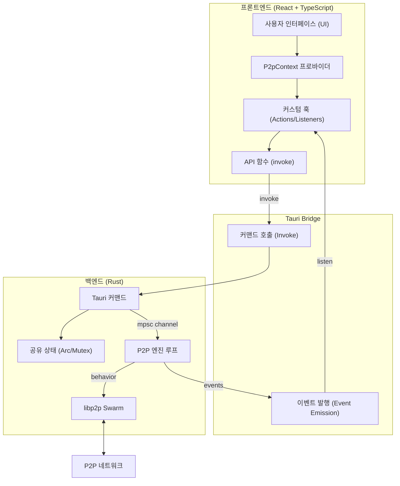
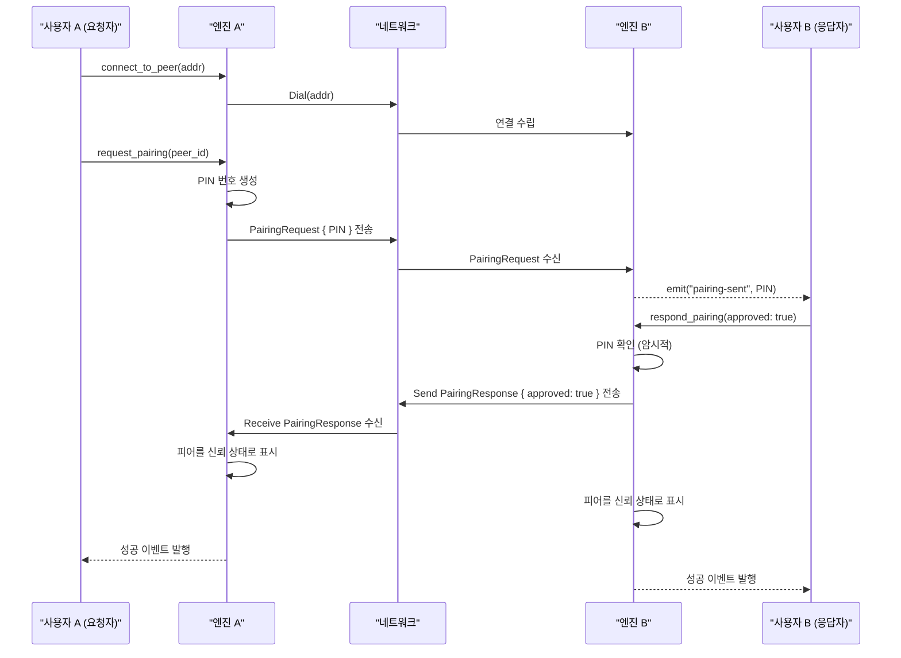
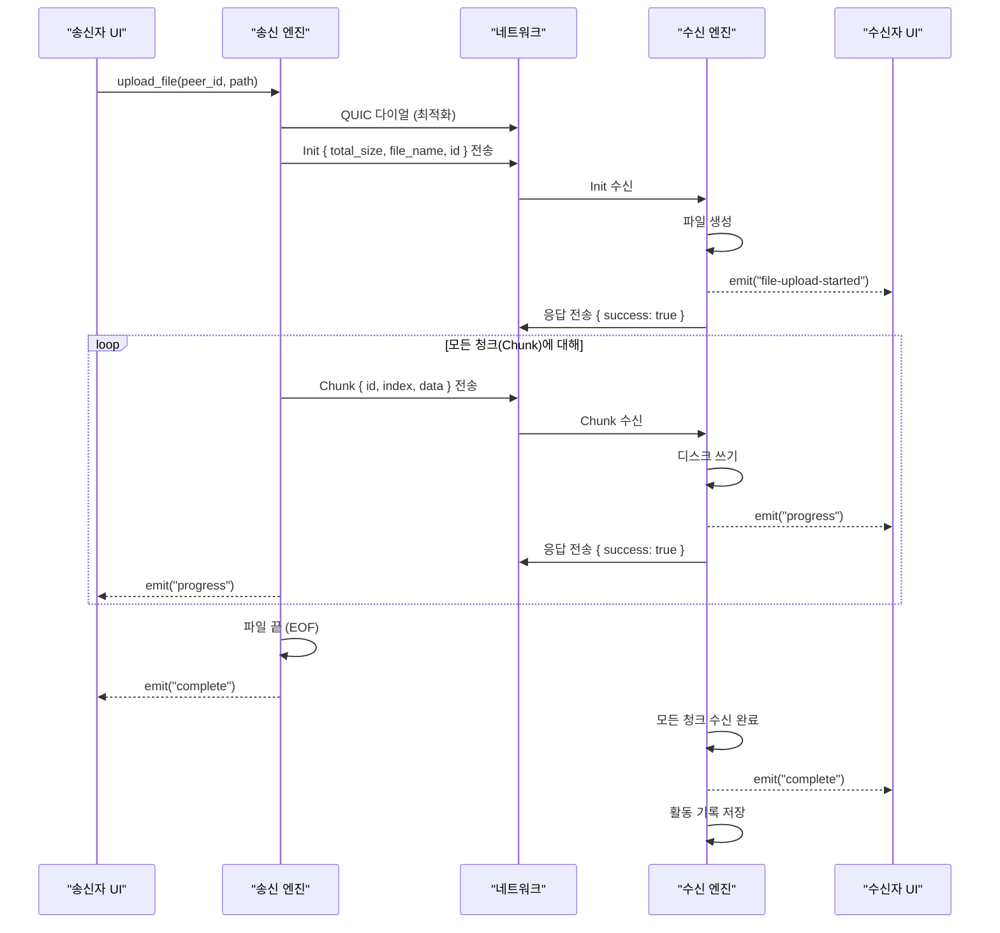

# Pebble 프로젝트 기술 문서

이 문서는 Pebble 프로젝트의 아키텍처, API 명세 및 주요 동작 흐름에 대한 포괄적인 개요를 제공합니다.

## 1. 시스템 아키텍처

Pebble 애플리케이션은 Tauri에 최적화된 **헥사고날 아키텍처(Hexagonal Architecture)** 패턴을 따릅니다. 프론트엔드(UI/제어)와 백엔드(로직/네트워킹)가 Tauri Bridge를 통해 명확히 분리되어 있습니다.

### 주요 구성 요소

1.  **프론트엔드 (`src/`)**:
    *   **Context (`P2pContext`)**: 애플리케이션 상태의 단일 진실 공급원(Single Source of Truth)입니다.
    *   **Hooks**: `useP2pActions`는 백엔드 커맨드를 실행하며, `useP2pEventListeners`는 백엔드의 실시간 업데이트를 수신합니다.
    *   **UI**: 컨텍스트를 소비하여 화면을 렌더링하는 React 컴포넌트들입니다.

2.  **백엔드 (`src-tauri/`)**:
    *   **Commands (`commands/`)**: 요청을 검증하고 채널을 통해 P2P 엔진에 메시지를 전달하는 단순 함수들입니다.
    *   **P2P 엔진 (`network/mod.rs`)**: 메인 이벤트 루프를 실행하는 별도의 비동기 작업입니다. `libp2p` swarm을 관리하고 채널로부터 온 메시지를 처리합니다.
    *   **네트워크 동작 (`network/behavior.rs`)**: 파일 목록 조회, 전송, 페어링, 탐색을 위한 `libp2p` 커스텀 프로토콜을 정의합니다.

---

## 2. API 문서 (Tauri 커맨드)

이 커맨드들은 `invoke`를 통해 프론트엔드에 노출됩니다. 모든 커맨드는 `Result<T, String>` (또는 `AppError`)를 반환합니다.

### 2.1 P2P 라이프사이클

| 커맨드 | 설명 | 입력 파라미터 | 반환값 |
| :--- | :--- | :--- | :--- |
| `start_p2p` | P2P 엔진 루프를 시작합니다. | - | `String` (성공 메시지) |
| `stop_p2p` | P2P 엔진을 중지합니다. | - | `String` (성공 메시지) |
| `get_p2p_status` | P2P 엔진 실행 여부를 확인합니다. | - | `bool` |

### 2.2 연결 및 페어링

| 커맨드 | 설명 | 입력 파라미터 | 반환값 |
| :--- | :--- | :--- | :--- |
| `connect_to_peer` | 특정 주소의 피어에 수동 연결합니다. | `addr: String` | `String` (로그) |
| `request_pairing` | 페어링 요청(PIN 생성)을 보냅니다. | `peer_id: String` | `String` (로그) |
| `respond_pairing` | 페어링 요청을 승인하거나 거절합니다. | `peer_id: String`, `approved: bool` | `String` (로그) |

### 2.3 파일 관리

| 커맨드 | 설명 | 입력 파라미터 | 반환값 |
| :--- | :--- | :--- | :--- |
| `set_shared_folder` | 공유할 로컬 폴더 경로를 설정합니다. | `path: String` | `String` |
| `get_shared_folder` | 현재 설정된 공유 폴더 경로를 가져옵니다. | - | `String` |
| `get_local_shared_files` | 공유 폴더 내의 파일을 안전하게 조회합니다. | `relative_path: String` | `Vec<LocalFileInfo>` |
| `request_file_list` | 원격 피어에게 파일 목록을 요청합니다. | `peer_id: String`, `path: String` | `String` (로그) |

### 2.4 파일 전송

| 커맨드 | 설명 | 입력 파라미터 | 반환값 |
| :--- | :--- | :--- | :--- |
| `upload_file` | 피어에게 파일을 스트리밍 방식으로 업로드합니다. | `peer_id`, `file_path`, `remote_path` | `String` |
| `download_file` | 파일을 다운로드합니다 (기존 방식). | `peer_id`, `path` | `String` |
| `cancel_transfer` | 진행 중인 전송을 취소합니다. | `transfer_id: String` | `String` |

### 2.5 설정 및 기기 정보

| 커맨드 | 설명 | 입력 파라미터 | 반환값 |
| :--- | :--- | :--- | :--- |
| `set_device_name` | 표시될 기기 이름을 설정합니다. | `name: String` | `String` |
| `get_device_name` | 현재 설정된 기기 이름을 조회합니다. | - | `String` |
| `set_shared_folder_display_name` | 공유 폴더의 별칭을 설정합니다. | `name: String` | `String` |
| `get_local_ip` | 현재 로컬 네트워크 IP를 조회합니다. | - | `String` |

---

## 3. 데이터 흐름 (Data Flow)

### 3.1 페어링 흐름 (Pairing Flow)

페어링 프로세스는 피어 간의 보안 통신을 보장합니다.

### 3.2 파일 업로드 흐름 (스트리밍 방식)

파일 전송은 `libp2p` 스트림 위에서 커스텀 청크 프로토콜을 사용하여 대용량 파일 전송 및 취소를 지원합니다.

## 4. 함수 상호작용 (Function Interactions)

### 프론트엔드-백엔드 브릿지 동작 방식

1.  **Action**: 사용자가 `LocalFilesView`에서 "업로드" 버튼을 클릭합니다.
2.  **Context**: `useP2pActions`의 `uploadFile` 함수가 `api.uploadFile`을 호출합니다.
3.  **Tauri**: `upload_file` 커맨드를 인보크(Invoke)합니다.
4.  **Command**: 경로를 검증하고 `FileTransferStreamRequestMsg`를 `file_stream_sender` 채널로 전송합니다.
5.  **Engine**: 
    *   채널로부터 메시지를 수신합니다.
    *   파일 스트림을 엽니다.
    *   `libp2p` request-response 프로토콜을 시작합니다.
    *   `file-upload-started` 이벤트를 발행(Emit)합니다.
6.  **Listener**: `useP2pEventListeners`가 이벤트를 수신하여 `activeTransfers` 상태를 업데이트합니다.
7.  **UI**: `ActivityView`에서 새로운 전송 바를 렌더링합니다.
